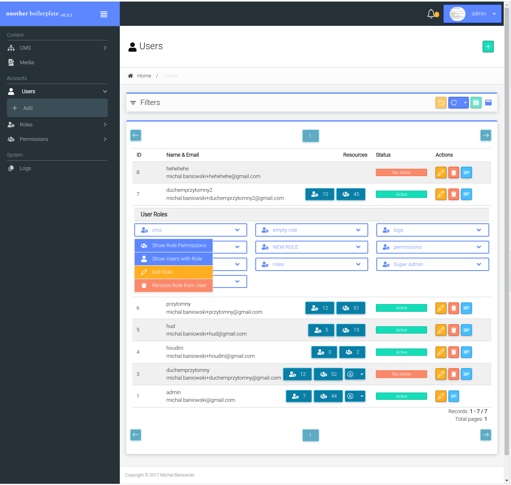
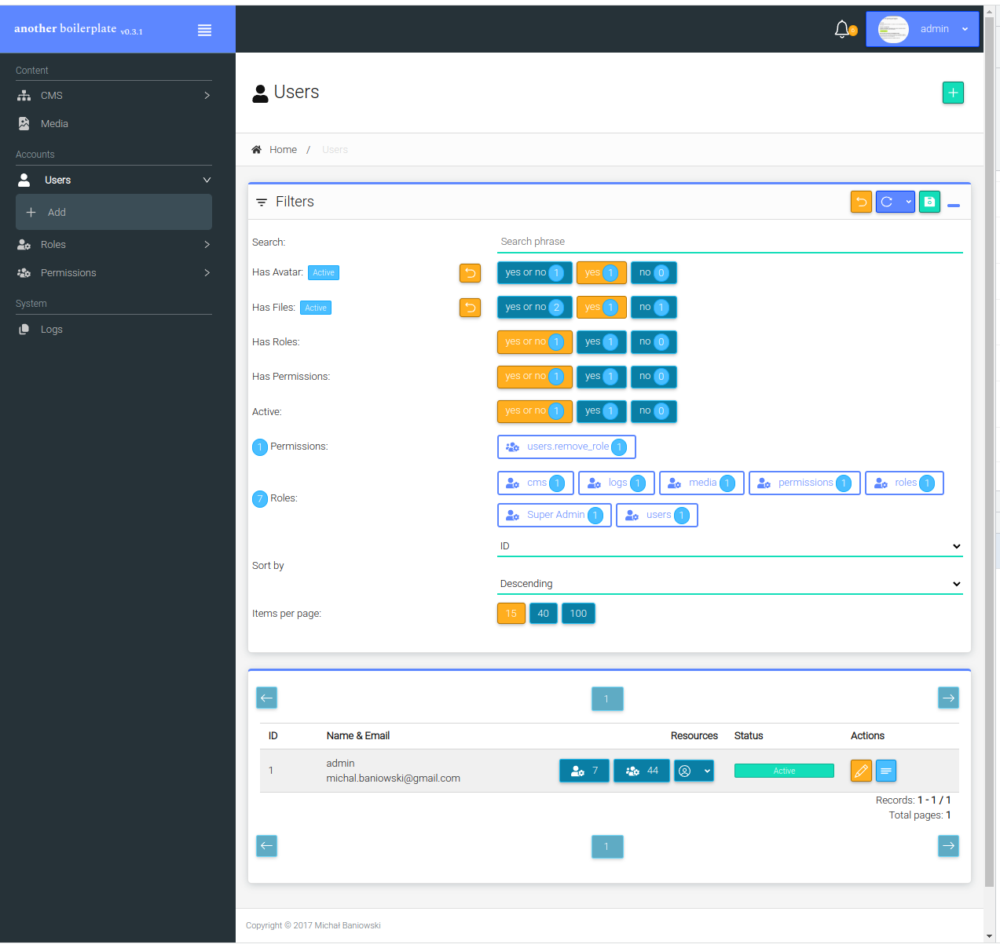
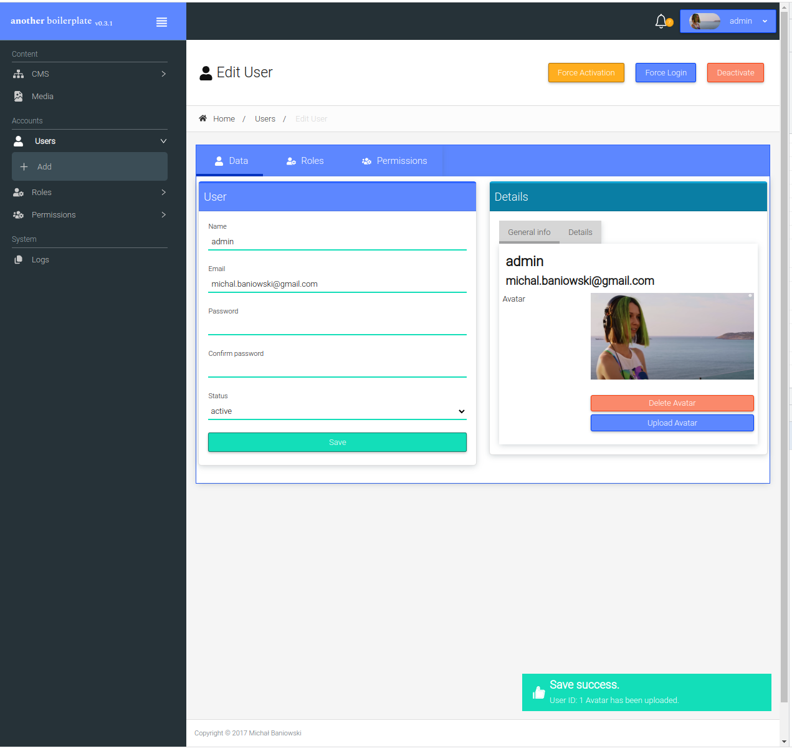
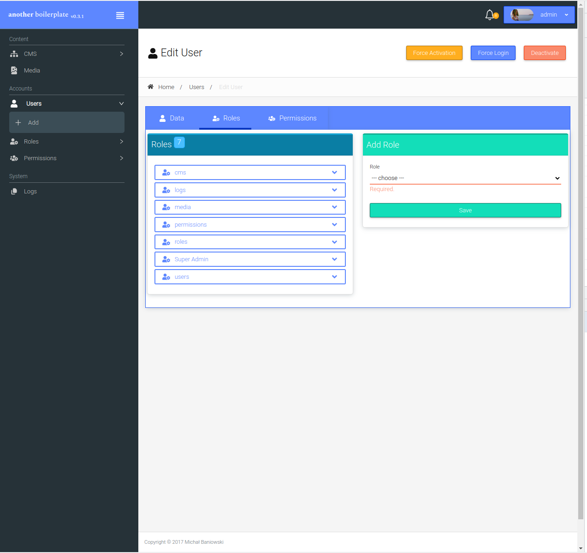
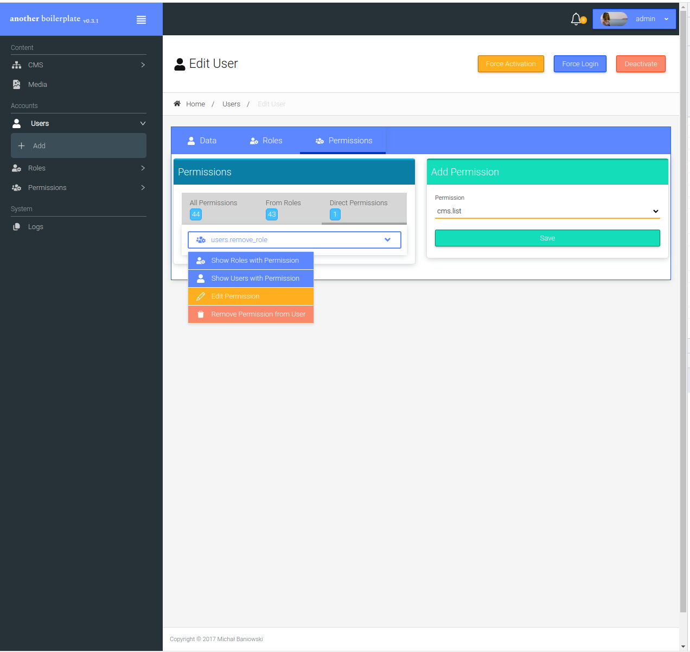
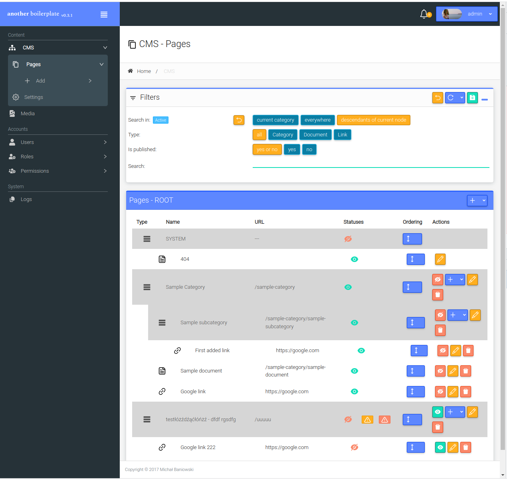

Create API/.env file with database credentials.

```cd API```

```composer install```

```composer update```

```php artisan migrate```

```php artisan db:seed```

---

```cd WWW```

```npm install```

```npm run build``` or ```npm start```

---

And you are ready to go.


### Demo

[https://another-react-boilerplate.baniowski.pro](https://another-react-boilerplate.baniowski.pro)







